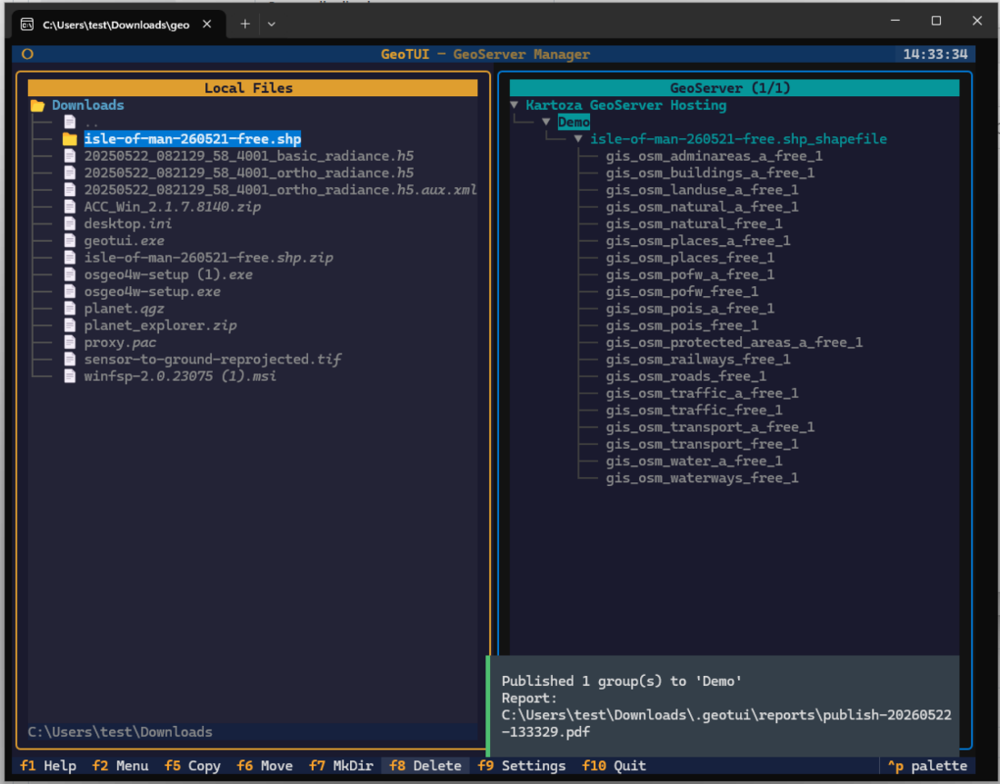

# GeoTUI

<div align="center">


**A Midnight Commander-style terminal interface for GeoServer management**

[](https://github.com/kartoza/geotui/releases/latest)
[](https://opensource.org/licenses/MIT)
[](https://www.python.org/downloads/)
[](https://github.com/kartoza/geotui/actions/workflows/ci.yml)
[](https://kartoza.github.io/geotui)

</div>



## What is GeoTUI?

GeoTUI is a terminal application for managing [GeoServer](https://geoserver.org/) instances. Browse your local geospatial files on the left, manage GeoServer workspaces and layers on the right — then publish data with a single keystroke.

**Who is it for?** GIS administrators, data engineers, and anyone who publishes geospatial data to GeoServer.

**Why use it?** Publishing data to GeoServer normally means navigating the web admin, uploading files, configuring stores, and creating layers through a browser. GeoTUI does all of this with F5: select your files, pick a workspace, press publish. It also generates PDF reports of every operation.

## Features

- **Dual-pane interface** — local files on the left, GeoServer tree on the right
- **One-click publishing** — Shapefiles, GeoPackages, and GeoTIFFs via F5
- **Multiple connections** — manage several GeoServer instances simultaneously
- **PDF reports** — every publish generates a detailed report
- **Encrypted credentials** — AES-encrypted vault with PBKDF2 key derivation (600k iterations)
- **Cross-platform** — standalone binaries for Windows, Linux, and macOS
- **Multilingual** — English, Portuguese, and Spanish (Ctrl+L to switch)
- **Kartoza branded** — beautiful orange, teal, and blue colour scheme

## Installation

### Download Pre-Built Binaries

Download the latest release from [GitHub Releases](https://github.com/kartoza/geotui/releases/latest).

#### Linux

| Format | File | Install Command |
|--------|------|-----------------|
| **AppImage** | `GeoTUI-x.y.z-x86_64.AppImage` | `chmod +x GeoTUI-*.AppImage && ./GeoTUI-*.AppImage` |
| **Debian/Ubuntu** | `geotui_x.y.z_amd64.deb` | `sudo dpkg -i geotui_*.deb` |
| **Fedora/RHEL** | `geotui-x.y.z-1.x86_64.rpm` | `sudo rpm -i geotui-*.rpm` |
| **Snap** | `geotui_x.y.z_amd64.snap` | `sudo snap install --dangerous geotui_*.snap` |
| **Standalone** | `geotui-linux-amd64` | `chmod +x geotui-linux-amd64 && sudo cp geotui-linux-amd64 /usr/local/bin/geotui` |

> **Unsigned packages:** .deb, .rpm, and .snap packages are not signed with a distribution key. For Snap use `--dangerous`. For RPM with GPG checking: `sudo rpm -i --nosignature geotui-*.rpm`.

#### macOS

| Architecture | File |
|-------------|------|
| **Intel (x86_64)** | `geotui-macos-amd64` |
| **Apple Silicon (M1/M2/M3)** | `geotui-macos-arm64` |

```bash
chmod +x geotui-macos-*
sudo cp geotui-macos-* /usr/local/bin/geotui
```

> **Gatekeeper:** Run `xattr -d com.apple.quarantine /usr/local/bin/geotui` or allow in System Settings > Privacy & Security on first launch.

#### Windows

Download `geotui-windows-amd64.exe`. On first launch, click **More info** then **Run anyway** when SmartScreen appears.

### From PyPI

```bash
pip install geotui
# or with pipx (recommended):
pipx install geotui
```

### Using Nix

```bash
nix run github:kartoza/geotui
```

### From Source

```bash
git clone https://github.com/kartoza/geotui.git
cd geotui
nix develop  # or: pip install -e ".[dev]"
python -m geotui
```

## Quick Start

```bash
geotui
```

1. Press **F9** to open Settings
2. Click **Add** and enter your GeoServer URL, username, and password
3. Click **Connect** to test, then **Escape** to return to the main view
4. Navigate to your data files in the left pane
5. Select a workspace in the right pane
6. Press **F5** to publish

For a detailed walkthrough with screenshots, see the [Getting Started guide](https://kartoza.github.io/geotui/user-guide/getting-started/).

## Key Bindings

| Key | Action |
|-----|--------|
| `Tab` | Switch between panes |
| `F2` | GeoServer Actions (create workspace, etc.) |
| `F5` | Publish selected files to GeoServer |
| `F7` | Create directory |
| `F8` | Delete |
| `F9` | Settings / Connection manager |
| `F10` / `q` | Quit |
| `Ctrl+L` | Cycle language (EN / PT / ES) |

## Documentation

Full documentation: [kartoza.github.io/geotui](https://kartoza.github.io/geotui)

- [Getting Started](https://kartoza.github.io/geotui/user-guide/getting-started/) — install, connect, publish
- [Navigation](https://kartoza.github.io/geotui/user-guide/navigation/) — keyboard shortcuts and workflows
- [Configuration](https://kartoza.github.io/geotui/user-guide/configuration/) — vault, language, colours
- [Architecture](https://kartoza.github.io/geotui/developer-guide/architecture/) — module structure and design
- [Contributing](https://kartoza.github.io/geotui/developer-guide/contributing/) — development setup

## Development

```bash
nix develop                    # Enter dev environment
python -m geotui               # Run the app
pytest                         # Run tests
ruff check src/ tests/         # Lint
cd docs && mkdocs serve        # Serve docs locally
```

## Contributing

We welcome contributions! See the [Contributing Guide](https://kartoza.github.io/geotui/developer-guide/contributing/) for development setup, code style, and workflow.

## License

MIT License — see [LICENSE](LICENSE) for details.

## Sustainable Funding

If you find GeoTUI useful, please consider supporting its development through [GitHub Sponsors](https://github.com/sponsors/kartoza).

---

Made with :heart: by [Kartoza](https://kartoza.com) | [Donate!](https://github.com/sponsors/kartoza) | [GitHub](https://github.com/kartoza/geotui)
