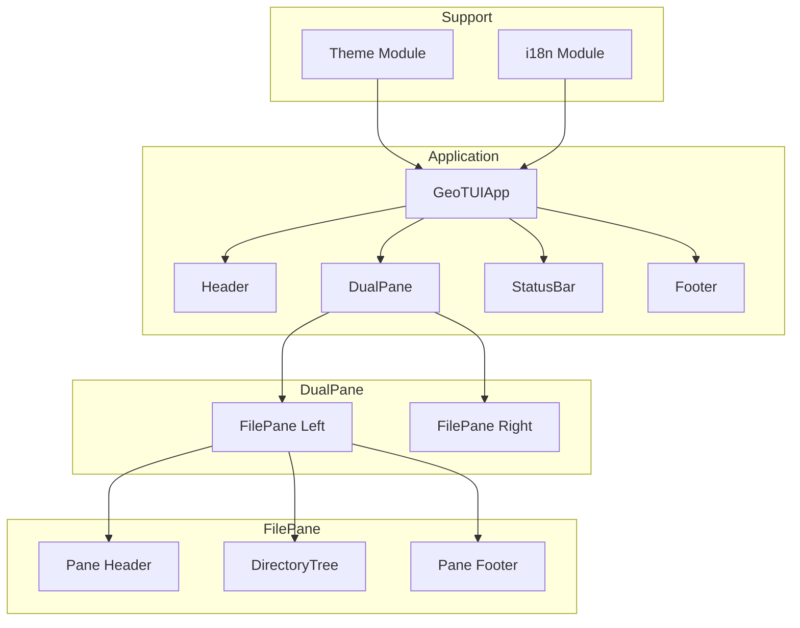

# GeoTUI - Technical Specification

## Version: 0.1.0

## 1. Overview

GeoTUI is a Midnight Commander-style terminal user interface (TUI) application for managing GeoServer instances. It provides a dual-pane interface built with Python using the Textual and Rich frameworks.

## 2. Architecture

### 2.1 Component Diagram

### 2.2 Technology Stack

| Component | Technology |
|-----------|-----------|
| Language | Python 3.10+ |
| TUI Framework | Textual |
| Rich Text | Rich |
| HTTP Client | httpx |
| Data Validation | Pydantic |
| Credential Storage | keyring |
| Build System | Hatch |
| Dev Environment | Nix Flake |

## 3. User Stories

### US-001: Dual Pane Navigation
**As a** GeoServer administrator
**I want** a Midnight Commander-style dual pane interface
**So that** I can efficiently browse and manage files and resources side by side

**Acceptance Criteria:**
- Application displays two side-by-side panes
- Each pane shows a directory tree
- Tab key switches active pane
- Active pane is visually distinguished (yellow/orange border)
- Inactive pane has blue border

### US-002: Language Switching
**As a** non-English speaking user
**I want** to switch the interface language
**So that** I can use the application in my preferred language

**Acceptance Criteria:**
- Ctrl+L cycles through English, Portuguese, Spanish
- GEOTUI_LANG environment variable sets initial language
- All UI strings are translatable

### US-003: File Navigation
**As a** user
**I want** to browse the file system in each pane
**So that** I can find and manage files

**Acceptance Criteria:**
- Directory tree shows folders and files
- Arrow keys navigate the tree
- Enter opens/expands directories
- Current path shown in pane footer

### US-004: Function Key Operations
**As a** Midnight Commander user
**I want** familiar function key bindings
**So that** I can use muscle memory from MC

**Acceptance Criteria:**
- F1: Help
- F2: Menu
- F5: Copy
- F6: Move
- F7: Create directory
- F8: Delete
- F9: Settings
- F10: Quit

### US-005: Bulk Shapefile Publishing
**As a** GeoServer administrator
**I want** to bulk publish thousands of shapefiles
**So that** I can set up large datasets without manual layer-by-layer configuration

**Acceptance Criteria:**
- Can discover and publish 4000+ shapefiles in one operation
- Supports create and update (idempotent)
- Dry-run mode for validation
- Concurrent uploads with configurable limit

### US-006: Publish Reporting
**As a** GeoServer administrator
**I want** a detailed report after bulk publishing
**So that** I have an audit trail of what was uploaded

**Acceptance Criteria:**
- PDF report with branded header, detail table, summary stats
- Color-coded rows (green=success, red=error, grey=skip, blue=dry-run)
- JSON report for automation
- Report path displayed after completion

### US-007: CLI Bulk Publishing
**As a** DevOps engineer
**I want** to run bulk publish from the command line
**So that** I can integrate it into CI/CD pipelines

**Acceptance Criteria:**
- `geotui publish` command with all options
- Uses saved connections (no credentials in command args)
- Progress output and exit code on failure
- PDF and JSON reports generated

## 4. Functional Requirements

### FR-001: Application Launch
- Application starts in dark mode by default
- Left pane is active on launch
- Both panes show user's home directory initially

### FR-002: Theming
- Kartoza brand colors applied consistently
- Rounded corner borders on all panes
- Dark and light theme support

### FR-003: Internationalization
- Three languages: English (default), Portuguese, Spanish
- Runtime language switching without restart
- gettext-based translation system

### FR-004: Security
- No plain-text credential storage
- HTTPS connections enforced
- Input validation on all user inputs
- No command injection vectors

### FR-005: Cross-Platform
- Windows (PowerShell) support
- Linux support
- macOS support

## 5. Non-Functional Requirements

### NFR-001: Performance
- Application launches in under 2 seconds
- UI responds to input within 100ms

### NFR-002: Testing
- Minimum 80% code coverage
- TDD and BDD test approaches
- Unit tests for all modules
- BDD features for user workflows

### NFR-003: Documentation
- mkdocs site with user, admin, and developer guides
- Google-style docstrings on all public functions
- Architecture diagrams in Mermaid

### NFR-004: CI/CD
- Pre-commit hooks for code quality
- GitHub Actions for PR validation
- Automated release with package building
- Documentation deployed to GitHub Pages

### FR-006: Connection Management
- Users can manage multiple GeoServer connection instances
- Each connection has: Name, URL, Username, Password
- Connections listed by name in settings screen (left panel)
- Selecting a connection shows its details (right panel, view mode)
- Inline edit form (no popups) for add/edit operations
- Connection testing via GeoServer REST API (/rest/about/version.json)
- Configuration persisted as JSON in XDG config directory
- Atomic file writes prevent corruption

### FR-007: GeoServer Resource Tree
- Right pane displays GeoServer resource hierarchy from active connection
- Tree shows: Workspaces > Stores (data/coverage/WMS) > Layers/Coverages
- Workspaces shown in blue, stores color-coded by type (teal=vector, orange=raster, blue=WMS)
- Tree loads asynchronously via worker thread
- Active connection restored on app startup
- Empty state shows "No connection active" message
- Refresh capability for reloading tree data

### FR-008: F5 Copy-to-Publish
- Midnight Commander F5 paradigm: select folder left, workspace/store right, F5
- Multi-format discovery: Shapefile, GeoPackage (.gpkg), GeoTIFF (.tif/.tiff)
- Auto-creates one store per format type (e.g. folder_shapefiles, folder_geotiff)
- Concurrent upload bounded by configurable concurrency (default: 4)
- Retry with exponential backoff on transient failures
- Idempotent: create new layers or update existing ones
- Progress in status bar + tree auto-refreshes as layers appear
- PDF + JSON report generated automatically after every publish
- Layer naming via basename strategy, collision detection before upload

### FR-009: Publish Reports
- PDF report with Kartoza + GeoTUI dual branding
- Three sections: job summary header, color-coded detail table, summary stats
- Handles 4000+ rows with paginated tables and repeating headers
- JSON report alongside PDF for programmatic consumption
- Reports saved to ~/.local/share/geotui/reports/
- Generated automatically after every F5 copy operation

### FR-010: CLI Interface
- `geotui publish` for headless/CI bulk publishing
- `geotui export` for workspace config export (stub)
- `geotui import-config` for config replay (stub)
- Uses saved connections from config.json
- Progress output and summary on completion

## 6. Version History

| Version | Date | Changes |
|---------|------|---------|
| 0.5.0 | 2026-05-21 | F5 copy-to-publish, multi-format support, replaces F2 bulk publish |
| 0.4.0 | 2026-05-20 | Bulk shapefile publisher, PDF/JSON reports, CLI interface |
| 0.3.0 | 2026-05-19 | GeoServer resource tree in right pane, full REST API client |
| 0.2.0 | 2026-05-19 | Connection management, settings screen, GeoServer API client |
| 0.1.0 | 2026-05-19 | Initial release - dual pane MC-style interface |
