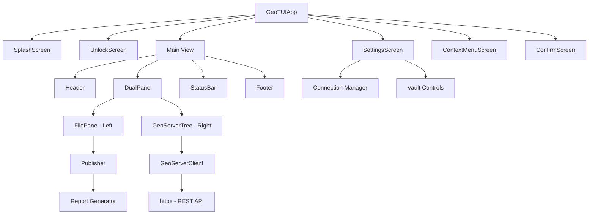

# Architecture

## Overview

GeoTUI is built on the [Textual](https://textual.textualize.io/) framework for Python, providing a rich terminal user interface with the familiar dual-pane layout of Midnight Commander. It connects to GeoServer instances via the REST API using `httpx` for async HTTP.

## Component Diagram



## Module Structure

```
src/geotui/
    __init__.py          # Package metadata and version
    __main__.py          # Entry point (python -m geotui)
    app.py               # Main GeoTUIApp class
    cli.py               # CLI argument parsing
    client.py            # GeoServer REST API client (async)
    config.py            # Connection config, encryption, vault
    publisher.py         # Shapefile/GeoPackage/GeoTIFF publisher
    report.py            # PDF report generation
    theme.py             # Kartoza brand colour theme
    screens/
        __init__.py
        confirm.py       # Confirmation dialog screen
        context_menu.py  # Right-click / F2 context menu
        logo_data.py     # ASCII art logo data
        settings.py      # F9 settings / connection manager
        splash.py        # Startup splash screen
        unlock.py        # Master password unlock screen
    widgets/
        __init__.py
        dual_pane.py     # MC-style dual pane container
        file_pane.py     # Local file system browser (left)
        geoserver_tree.py # GeoServer connection tree (right)
        status_bar.py    # Bottom status bar with messages
    styles/
        app.tcss         # Textual CSS styles
    i18n/
        __init__.py      # Translation functions (_())
        messages.pot     # Translation template
        locales/         # Language-specific .po/.mo files
```

## Key Design Decisions

1. **Textual Framework** — cross-platform TUI with CSS-like styling, rich widgets, and async support
2. **Fernet Encryption** — AES-128-CBC + HMAC-SHA256 for credential storage with PBKDF2 key derivation
3. **Async HTTP (httpx)** — non-blocking GeoServer API calls so the UI remains responsive during uploads
4. **Pydantic Models** — type-safe connection configuration with validation
5. **TCSS Styling** — separate stylesheet for maintainable theming with Kartoza brand colours
6. **gettext i18n** — standard Python internationalisation for EN/PT/ES
7. **PDF Reports** — publish operations generate PDF reports using `reportlab`

## Data Flow

### Connection Setup
```
User → F9 Settings → Add Connection → Master Password (first time)
    → Encrypt credentials → Save config.json
```

### Publishing
```
User → Select files (left pane) → Select workspace (right pane) → F5
    → Upload via REST API → Create datastore → Publish layers
    → Generate PDF report → Refresh tree
```

### Authentication
```
Launch → Splash → Unlock Screen (master password)
    → Decrypt vault → Load connections → Connect to GeoServers
```

---

Made with :heart: by [Kartoza](https://kartoza.com) | [Donate!](https://github.com/sponsors/kartoza) | [GitHub](https://github.com/kartoza/geotui)
