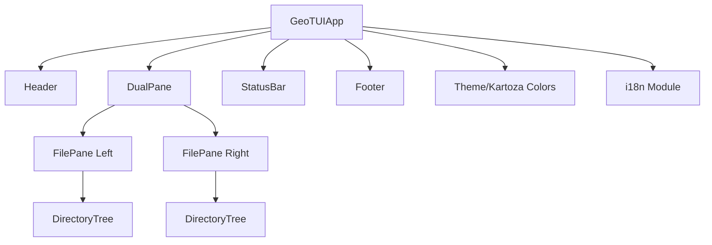

# Architecture

## Overview

GeoTUI is built on the Textual framework for Python, providing a rich terminal user interface with the familiar dual-pane layout of Midnight Commander.

## Component Diagram



## Module Structure

```
src/geotui/
    __init__.py          # Package metadata
    __main__.py          # Entry point
    app.py               # Main application class
    theme.py             # Kartoza brand theme
    styles/
        app.tcss         # Textual CSS styles
    widgets/
        __init__.py
        dual_pane.py     # MC-style dual pane container
        file_pane.py     # Individual file browser pane
        status_bar.py    # Bottom status bar
    i18n/
        __init__.py      # Translation functions
        messages.pot     # Translation template
        locales/         # Language-specific translations
```

## Key Design Decisions

1. **Textual Framework**: Chosen for cross-platform TUI support with rich styling
2. **Reactive Properties**: Pane state managed via Textual reactive system
3. **TCSS Styling**: Separate stylesheet for maintainable theming
4. **gettext i18n**: Standard Python internationalization for 3 languages
5. **Keyring Storage**: System keyring for secure credential management

---

Made with :heart: by [Kartoza](https://kartoza.com) | [Donate!](https://github.com/sponsors/kartoza) | [GitHub](https://github.com/kartoza/geotui)
