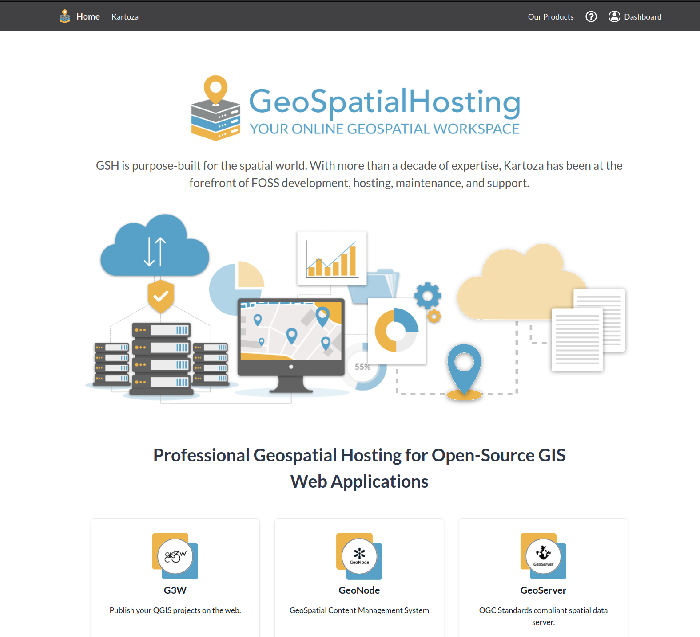
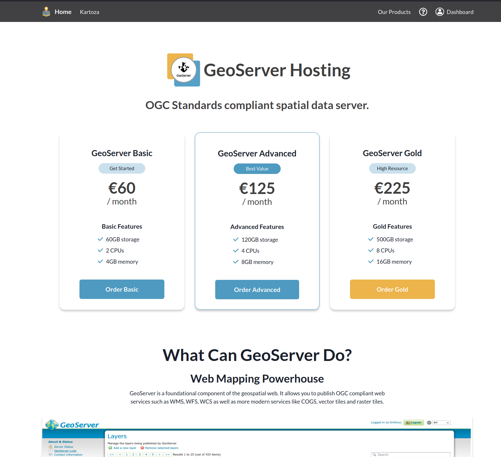
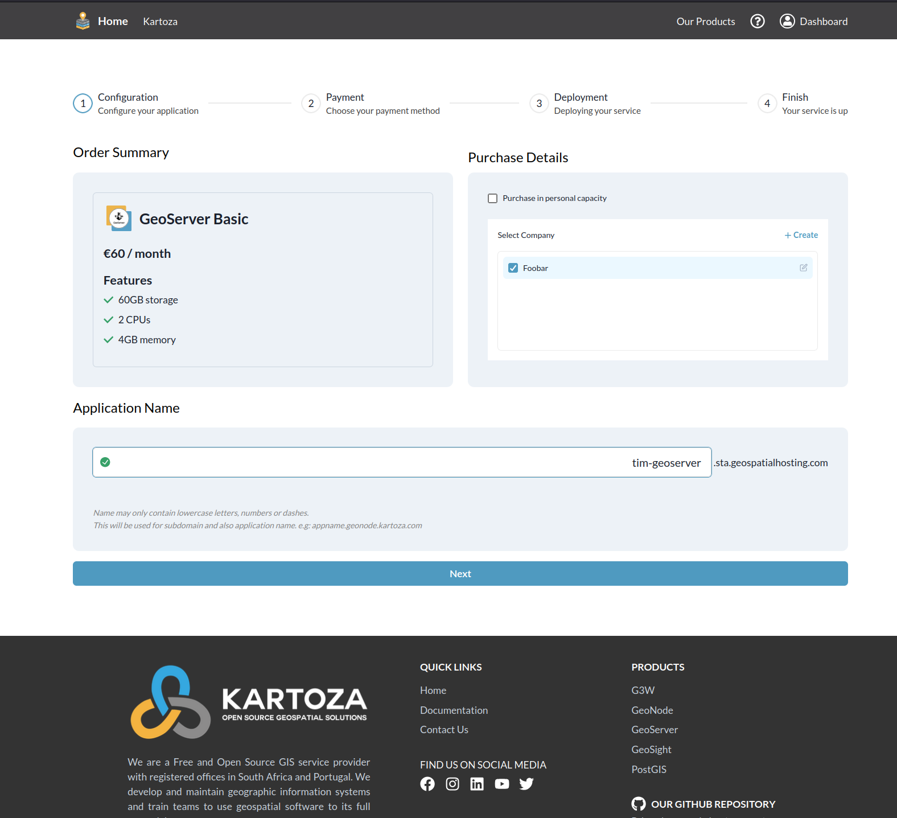
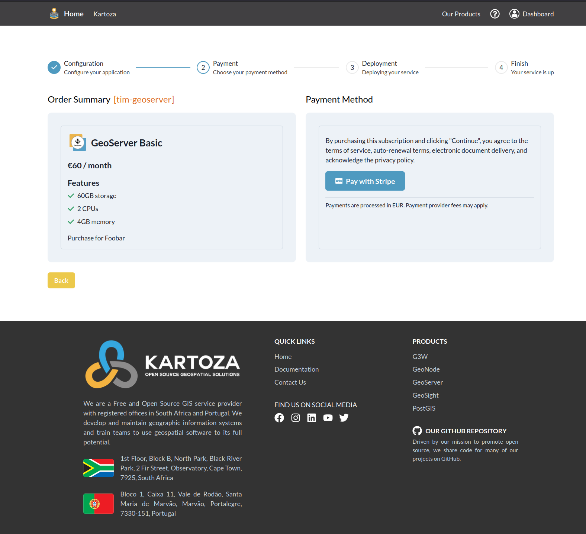
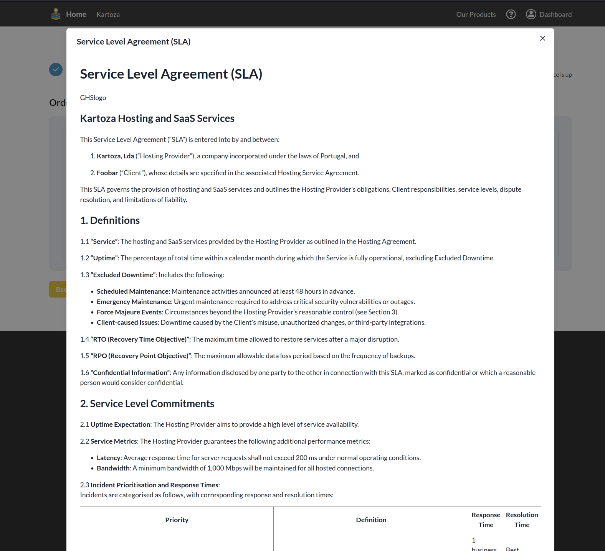
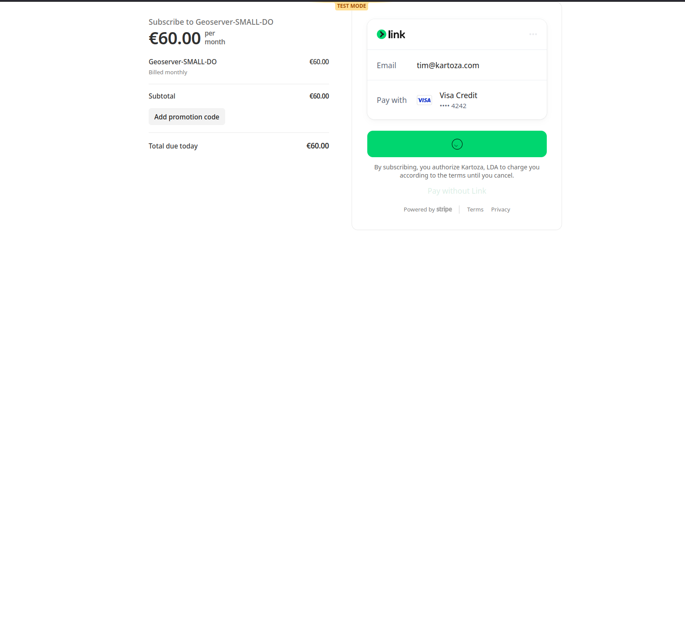
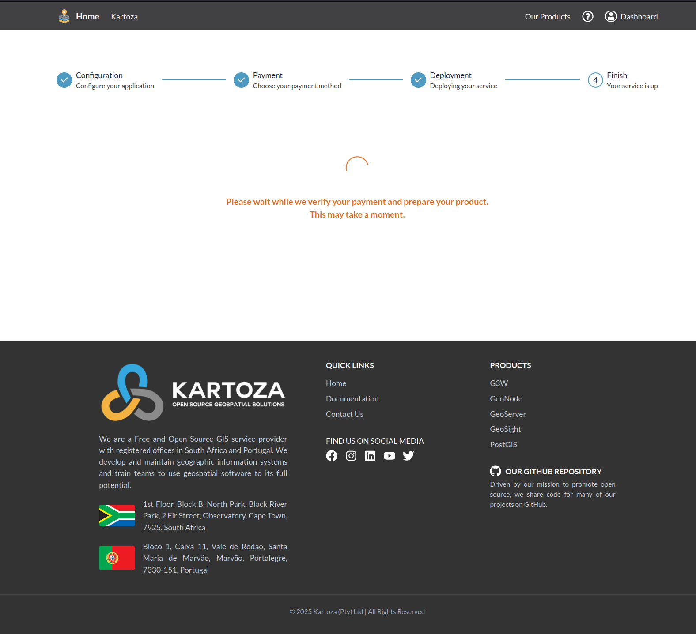
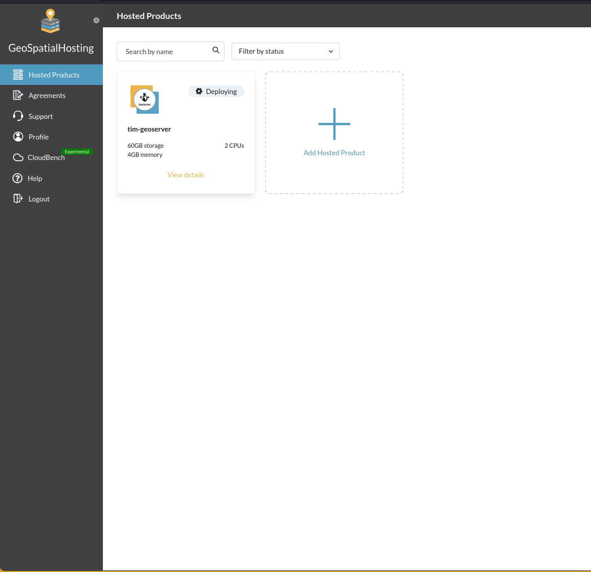
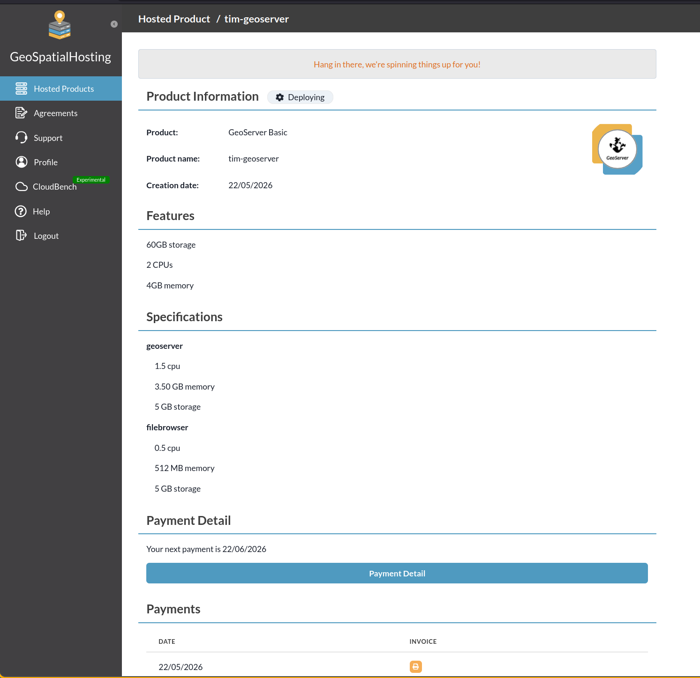
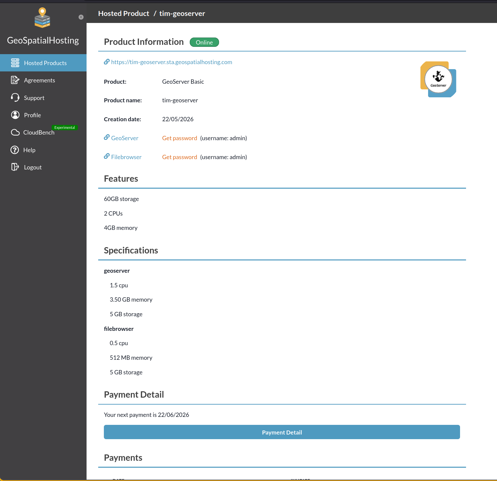

# Connecting to GeoSpatialHosting

[GeoSpatialHosting](https://geospatialhosting.com) (GSH) is a managed hosting platform by [Kartoza](https://kartoza.com) for open-source geospatial applications including GeoServer, GeoNode, and G3W. This guide shows how to provision a GeoServer instance on GSH and connect it to GeoTUI.

## Step 1: Visit GeoSpatialHosting

Go to [geospatialhosting.com](https://geospatialhosting.com) and sign up or log in:

## Step 2: Choose a GeoServer Plan

Navigate to the GeoServer product page. GSH offers three tiers:

| Plan | Storage | CPUs | Memory | Price |
|------|---------|------|--------|-------|
| **Basic** | 60 GB | 2 | 4 GB | from 60 EUR/month |
| **Advanced** | 120 GB | 4 | 8 GB | from 125 EUR/month |
| **Gold** | 500 GB | 8 | 16 GB | from 225 EUR/month |

## Step 3: Configure Your Instance

Choose your plan, select your company, and pick an application name. This name becomes your subdomain (e.g. `tim-geoserver.sta.geospatialhosting.com`):

!!! tip "Naming your instance"
    The application name must contain only lowercase letters, numbers, and dashes. Choose something memorable — this will be the URL you enter in GeoTUI.

## Step 4: Complete Payment

Review the Service Level Agreement and proceed to payment via Stripe:

## Step 5: Wait for Deployment

After payment, GSH provisions your GeoServer instance. This takes a few minutes:

You can monitor progress on the Hosted Products dashboard:

Once deployment completes, your product page shows the full details including connection credentials, resource specifications, and payment information:

!!! info "Finding your credentials"
    Click **Get password** next to the GeoServer entry to reveal your admin password. The username is `admin` by default. You'll need these to connect from GeoTUI.

## Step 6: Connect from GeoTUI

Now open GeoTUI and press **F9** to open Settings. Click **Add** and enter:

- **Name**: `Kartoza GeoServer Hosting` (or any label you prefer)
- **URL**: `https://your-name.sta.geospatialhosting.com/`
- **Username**: `admin`
- **Password**: the admin password from your GSH dashboard

Click **Save**, then select the connection and click **Connect**:

You should see "Connected to GeoServer 2.26.1" (or your deployed version). Press **Escape** to return to the main screen and start managing your GeoServer.

## Troubleshooting

| Issue | Solution |
|-------|----------|
| "No workspaces found" | Your GeoServer is freshly deployed. Use **F2 > Create Workspace** to create one. |
| "Authentication failed" | Double-check your password in GSH dashboard. GeoTUI encrypts credentials locally. |
| Connection timeout | Ensure your instance is fully deployed (check GSH dashboard for "Running" status). |
| 404 errors | GeoTUI auto-detects the `/geoserver` path prefix. Ensure your URL doesn't include it. |

---

Made with :heart: by [Kartoza](https://kartoza.com) | [Donate!](https://github.com/sponsors/kartoza) | [GitHub](https://github.com/kartoza/geotui)
