# Getting Started

This guide walks you through installing GeoTUI on Windows and connecting it to a GeoServer instance hosted on [GeoSpatialHosting.com](https://geospatialhosting.com). The same steps apply on Linux and macOS — only the installation differs.

## Step 1: Download GeoTUI

Download the latest release for your platform from the [GitHub Releases](https://github.com/kartoza/geotui/releases) page.

For Windows, download `geotui-windows-amd64.exe`.

## Step 2: Handle the SmartScreen Warning

Because GeoTUI is not code-signed with a Microsoft certificate, Windows Defender SmartScreen will block the download and first run.

**In your browser**, you may see a warning that the download was blocked. Click the menu icon and choose **Keep**:

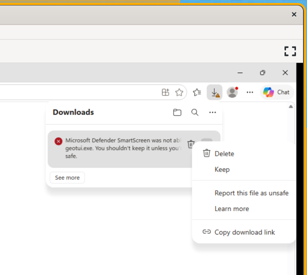

**When you run the .exe**, Windows will show "Windows protected your PC". Click **More info** to reveal the Run anyway button:

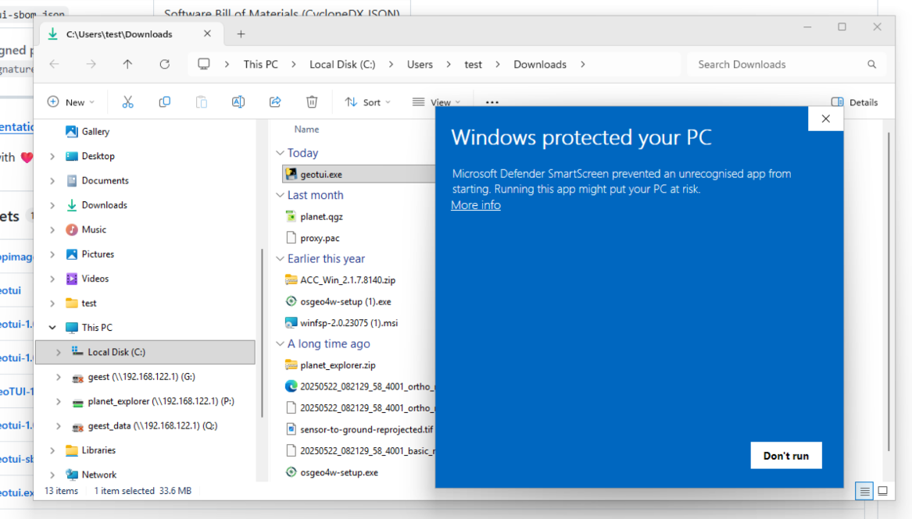

Then click **Run anyway** to launch GeoTUI:

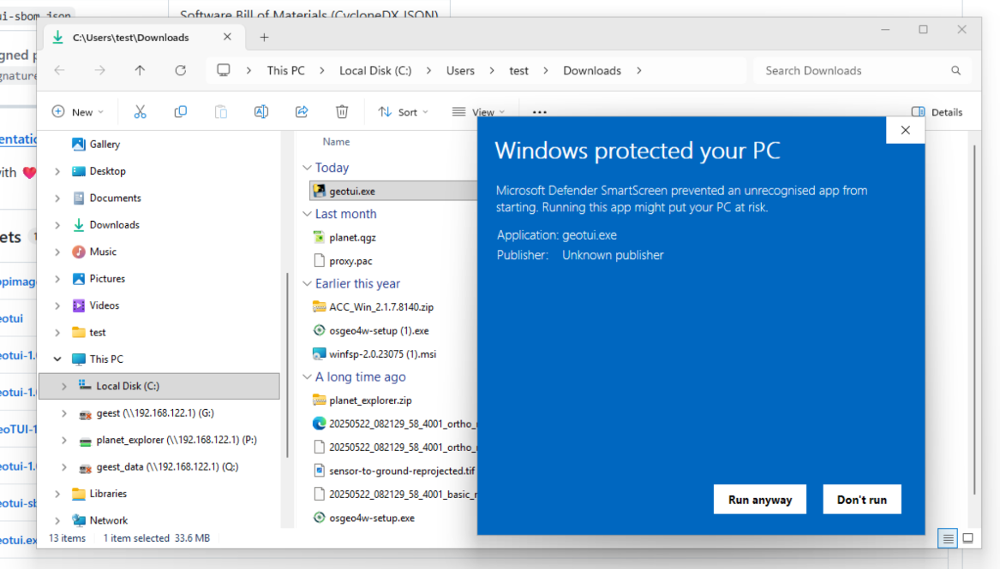

!!! tip "This only happens once"
    SmartScreen remembers your choice. You won't see this warning again for the same version.

## Step 3: First Launch

GeoTUI opens with a dual-pane interface inspired by Midnight Commander:

- **Left pane** — your local file system
- **Right pane** — GeoServer connections (currently empty)
- **Footer** — function key shortcuts (F1-F10)

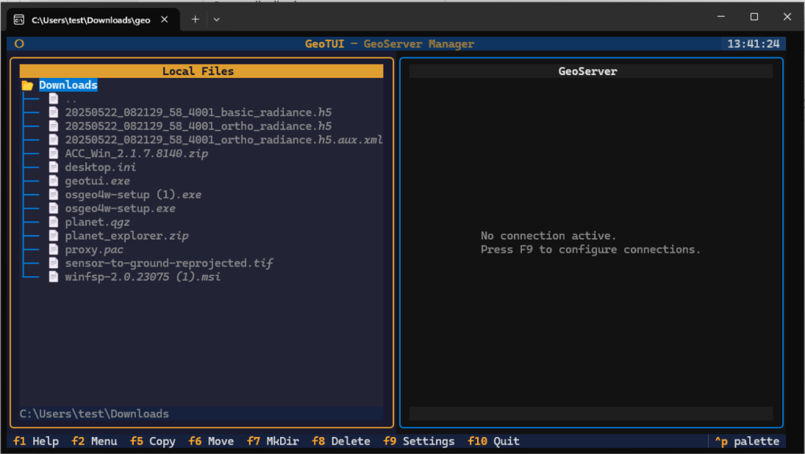

The right pane shows "No connection active. Press F9 to configure connections." — let's do that next.

## Step 4: Open Settings (F9)

Press **F9** to open the Settings screen. You'll see the connection manager with an empty list on the left and connection details on the right:

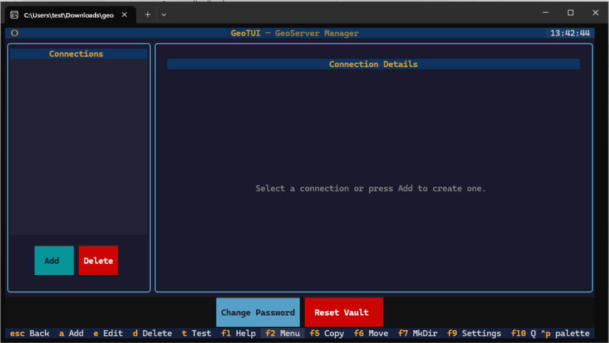

Notice the **Change Password** and **Reset Vault** buttons at the bottom — these manage your encrypted credential vault (more on this below).

## Step 5: Create a Master Password

When you add your first connection, GeoTUI will prompt you to create a **master password**. This password encrypts all your GeoServer credentials using AES-256 encryption:

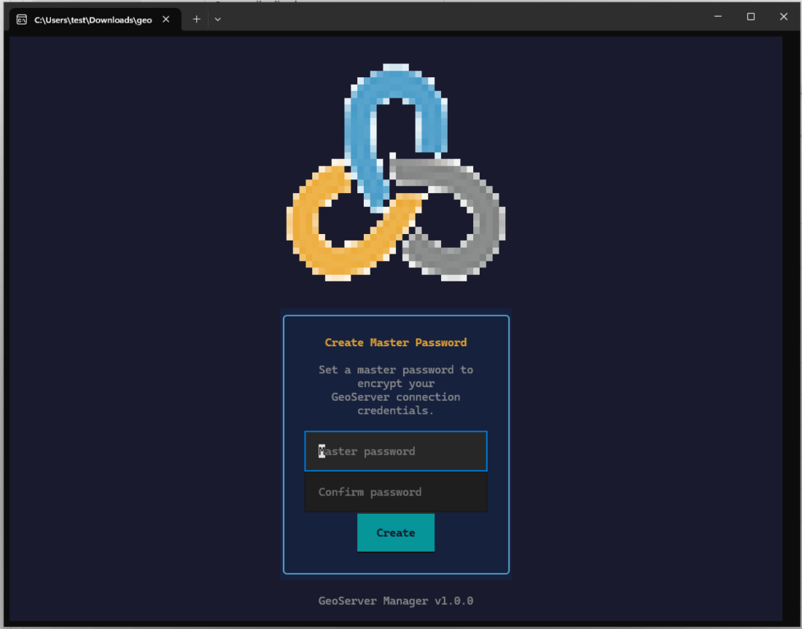

!!! warning "Remember your master password"
    If you forget your master password, the only recovery option is **Reset Vault**, which deletes all saved connections. There is no password recovery.

## Step 6: Add a Connection

Click **Add** and fill in your GeoServer connection details:

- **Name** — a friendly label (e.g. "Kartoza GeoServer Hosting")
- **URL** — your GeoServer base URL
- **Username** — your GeoServer admin username
- **Password** — your GeoServer admin password

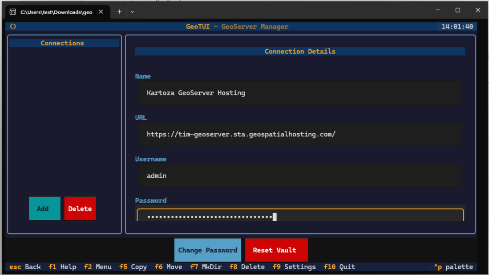

Click **Save** to store the connection. Your password is encrypted before it's written to disk.

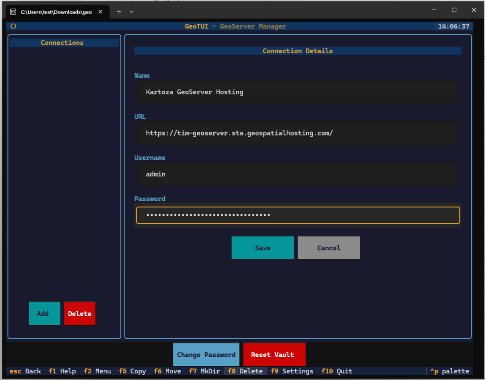

## Step 7: Test the Connection

After saving, select your connection from the list and click **Connect**. You'll see "Testing connection..." followed by a success message showing the GeoServer version:

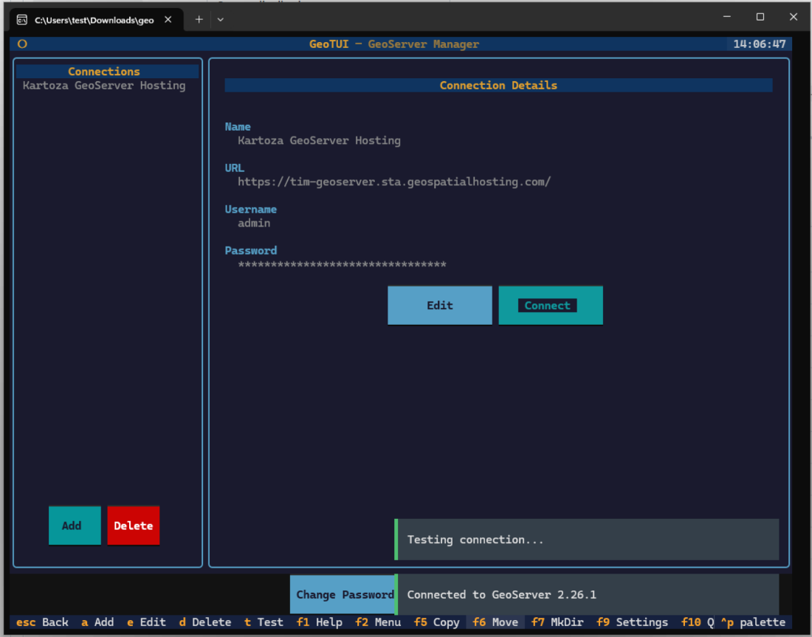

Press **Escape** to return to the main screen. Your GeoServer tree will appear in the right pane.

## Step 8: Explore Your GeoServer

Back on the main screen, expand your connection in the right pane to browse workspaces, stores, and layers:

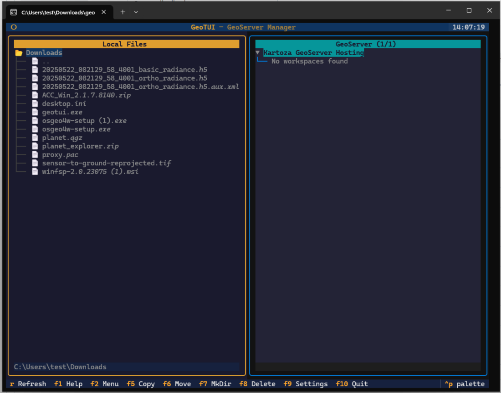

If you see "No workspaces found", you can create one using the **F2** menu:

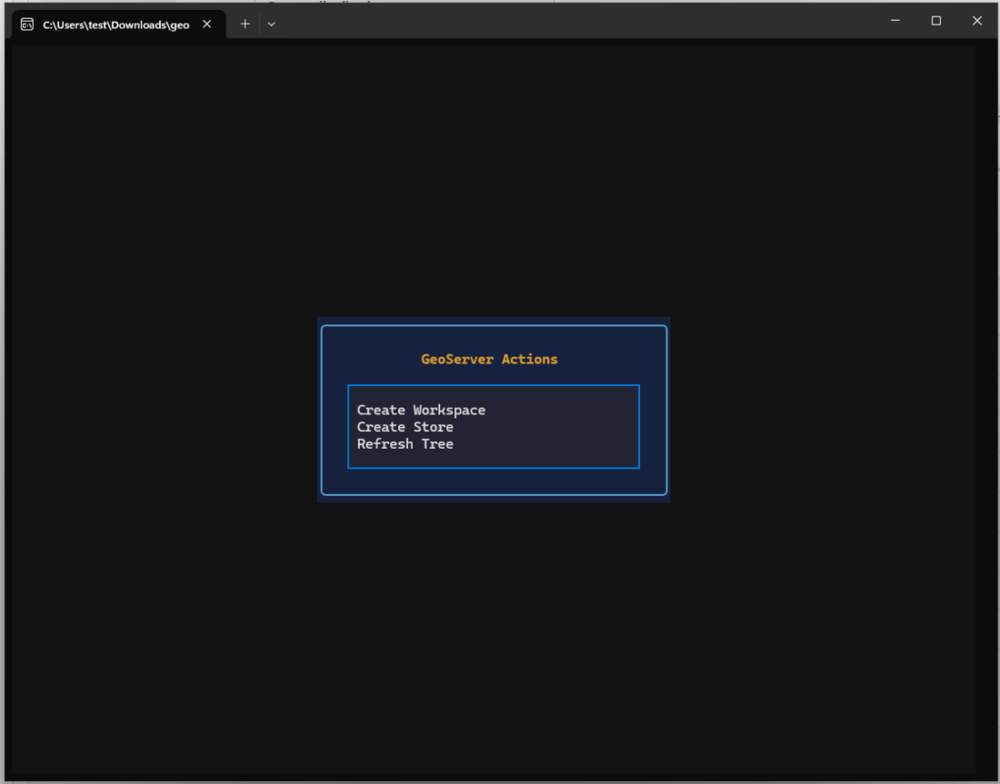

Select **Create Workspace** and enter a name:

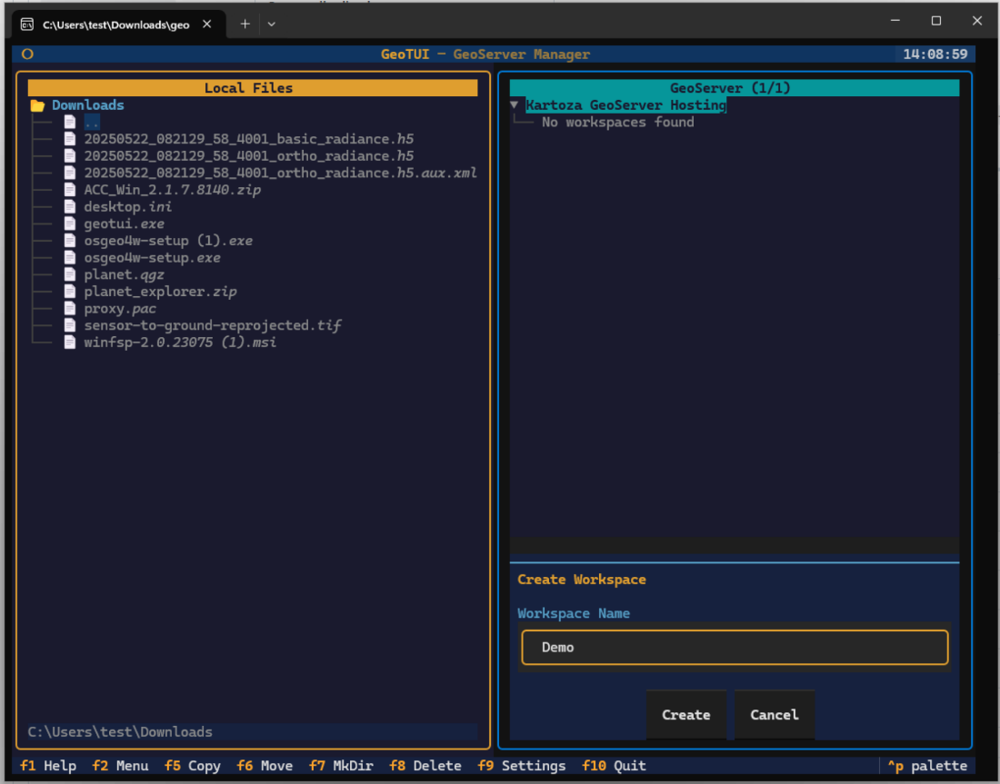

## Step 9: Publish Data

Navigate to a shapefile directory in the left pane and press **F5** to publish it to your GeoServer. GeoTUI will create a datastore and publish all layers automatically, showing progress as it works:

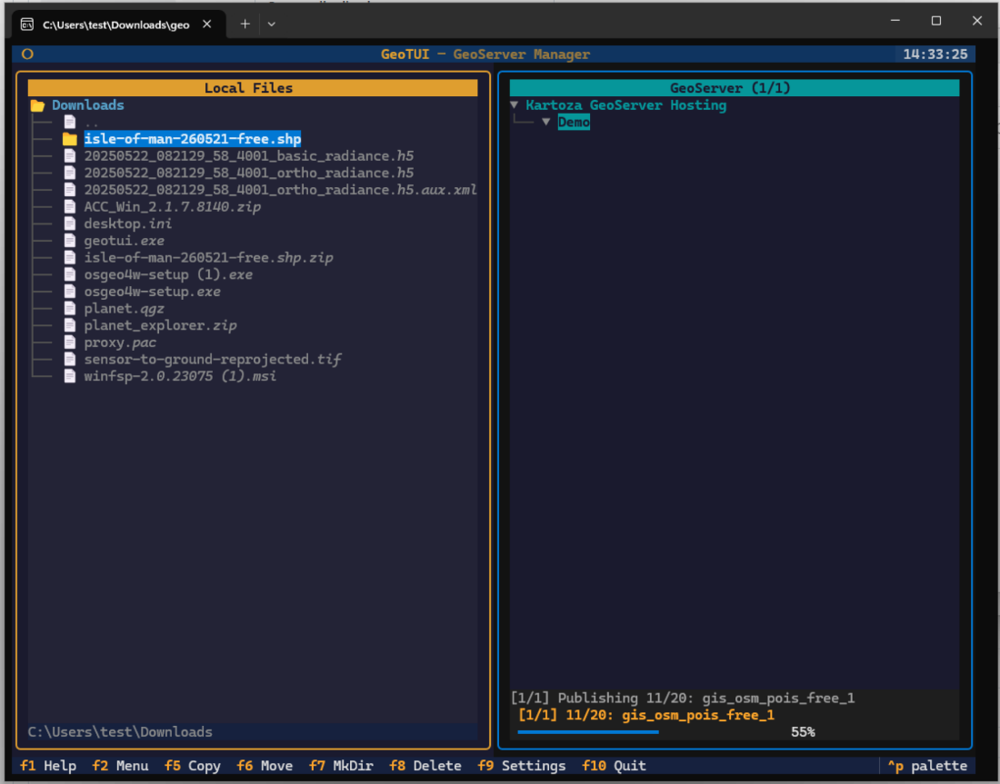

Once complete, all layers appear in the right pane under the workspace, and a PDF report is saved locally:

## Step 10: Verify in GeoServer

Open the GeoServer web interface to confirm your layers are available. The Layer Preview page shows all published layers with preview links:

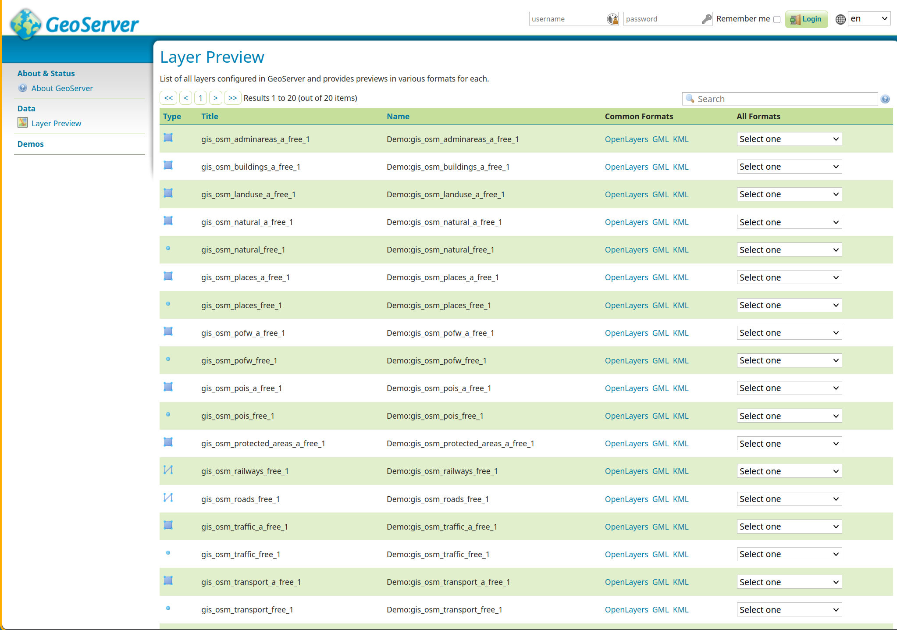

Click **OpenLayers** next to any layer to see it rendered on a map:

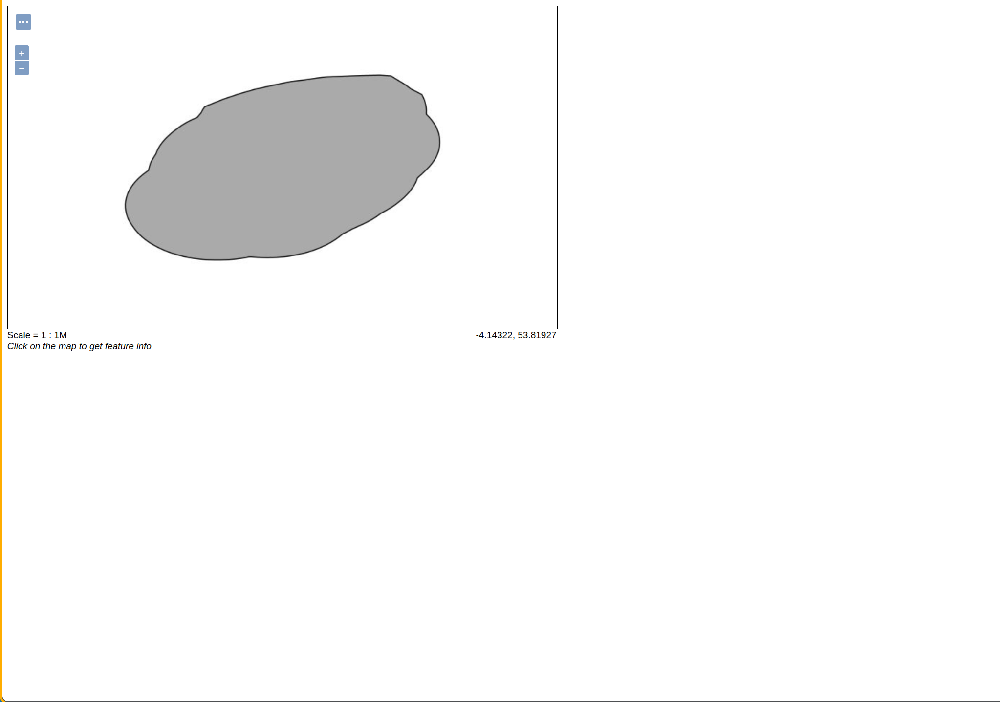

## Next Steps

- **[Navigation Guide](navigation.md)** — learn keyboard shortcuts and file selection
- **[Connecting to GeoSpatialHosting](connecting-gsh.md)** — provision a hosted GeoServer instance
- **[Configuration](configuration.md)** — advanced settings and vault management

---

Made with :heart: by [Kartoza](https://kartoza.com) | [Donate!](https://github.com/sponsors/kartoza) | [GitHub](https://github.com/kartoza/geotui)
