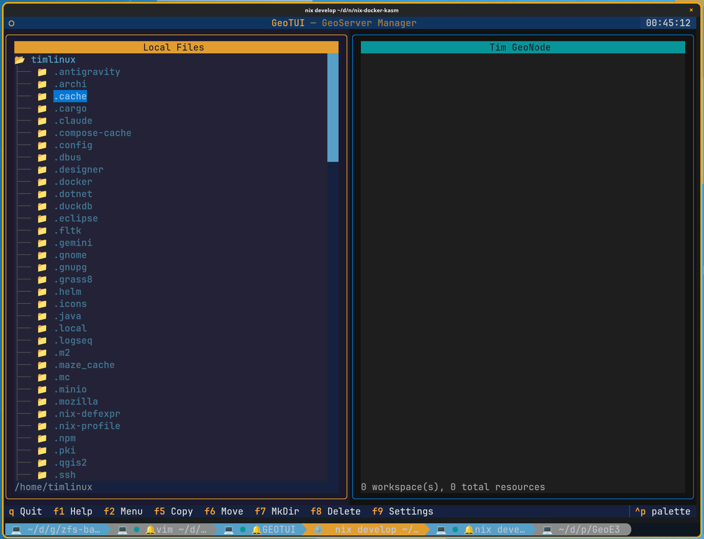
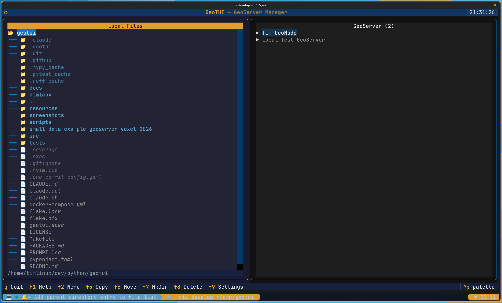

# Navigation

## Dual-Pane Interface

GeoTUI uses a Midnight Commander-style dual-pane layout:

- **Left pane** — your local file system browser
- **Right pane** — GeoServer connection tree showing workspaces, stores, and layers

## Multiple Connections

GeoTUI supports multiple simultaneous GeoServer connections. The right pane header shows how many connections are active (e.g. "GeoServer (2)"):

Each connection appears as a collapsible tree node. Expand a connection to browse its workspaces, and expand a workspace to see its datastores and layers.

## Key Bindings

| Key | Action |
|-----|--------|
| **Tab** | Switch active pane |
| **Arrow Up/Down** | Navigate tree items |
| **Enter** | Expand/collapse directory or tree node |
| **Backspace** | Navigate to parent directory |
| **r** | Refresh the GeoServer tree |
| **q** | Quit |
| **F1** | Help |
| **F2** | GeoServer Actions menu (create workspace, etc.) |
| **F5** | Copy / Publish selected files to GeoServer |
| **F6** | Move |
| **F7** | Create directory |
| **F8** | Delete |
| **F9** | Settings (connection manager) |
| **F10** | Quit |
| **Ctrl+L** | Cycle language (EN/PT/ES) |
| **Ctrl+P** | Toggle colour palette |

## Publishing Workflow

1. In the **left pane**, navigate to a directory containing geospatial data (Shapefile, GeoPackage, or GeoTIFF)
2. Select the file or directory you want to publish
3. In the **right pane**, select the target workspace
4. Press **F5** to publish

GeoTUI will:

- Create a new datastore on the GeoServer
- Publish all layers from the data source
- Show a progress bar during upload
- Generate a PDF report summarising the operation

## Pane Indicators

The active pane is highlighted with the Kartoza orange border. The inactive pane uses the teal/cyan border.

---

Made with :heart: by [Kartoza](https://kartoza.com) | [Donate!](https://github.com/sponsors/kartoza) | [GitHub](https://github.com/kartoza/geotui)
